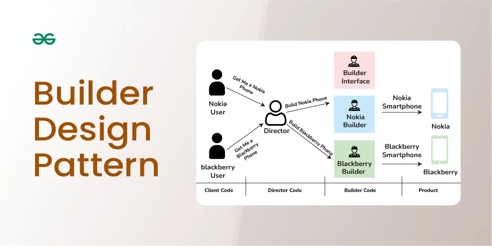

## Builder Pattern (Creational)
The Builder Design Pattern is a creational pattern that lets you construct complex objects step-by-step, separating the construction logic from the final representation.



### The problem

You want to create a `User` object

```java
User user =  new User(
        "Kranthi",
        "Reddy",
        "kranthi@gmail.com",
        "9999999999",
        25,
        "India",
        true,
        false,
        "ADMIN"
);
```
What's Wrong here?

Telescoping constructor Problem
* Too many parameters
* Order matters (easy to mess up)
* Readability is horrible
* Optional fields explode constructors
* Impossible to enforce object validity cleanly

In Production:
* Devs pass null
* Fields gets swapped accidentally
* Bugs appear months later

### What builder Pattern solves
Builder separates
* How an object is built
* From what the object is

It allows:
* Step by step construction
* Optional parameters
* Immutability
* Validation before object creation
* Readable and self-documenting code

### Intent

Builder pattern constructs a complex object step by step,
allowing the same construction process to create different representations.

### Basic Builder Structure
Participants
1. product - the object being built
2. Builder - defines construction steps
3. Concrete Builder - implements steps
4. Director (optional) -- controls construction order

### Production-Ready 

```java
public class UserBp {
    private final String firstName;
    private final String lastName;
    private final String email;
    private final Integer age;
    private final String country;

    private UserBp(UserBuilder builder){
        this.firstName = builder.firstName;
        this.lastName = builder.lastName;
        this.email=builder.email;
        this.age = builder.age;
        this.country =builder.country;
    }

    public static class UserBuilder{
        private String firstName;
        private String lastName;
        private String email;
        private Integer age;
        private String country;

        public UserBuilder firstName(String firstName){
            this.firstName = firstName;
            return this;
        }

        public UserBuilder lastName(String lastName){
            this.lastName = lastName;
            return this;
        }
        public UserBuilder email(String email){
            this.email = email;
            return this;
        }
        public UserBuilder age(Integer age){
            this.age = age;
            return this;
        }
        public UserBuilder country(String country){
            this.country = country;
            return this;
        }

        public UserBp build(){
            validate();
            return new UserBp(this);
        }

        private void validate(){
            if(email == null || !email.contains("@")){
                throw new IllegalStateException("Invalid email");
            }
        }

    }

    @Override
    public String toString() {
        return "User{" +
                "firstName='" + firstName + '\'' +
                ", lastName='" + lastName + '\'' +
                ", email='" + email + '\'' +
                ", age=" + age +
                ", country='" + country + '\'' +
                '}';
    }
}
```
Usage;
```java
public class BuilderMain {
    public static void main(String[] args) {
        UserBp user = new UserBp.UserBuilder()
                .firstName("kranthi")
                .lastName("reddy")
                .email("k@k.com")
                .age(26)
                .country("india")
                .build();

        System.out.println(user);
    }
}

```
* Readable
* Safe
* Flexible
* Immutable

### Key Characteristics

| Aspect                  | Builder           |
| ----------------------- | ----------------- |
| Object mutability       | Usually immutable |
| Handles optional fields | YES               |
| Readability             | EXCELLENT         |
| Validation              | Centralized       |
| Construction complexity | Hidden            |

### Builder vs Other Patterns

| Constructor          | Builder                 |
| -------------------- | ----------------------- |
| Hard to read         | Fluent                  |
| No optional handling | Easy                    |
| Order matters        | Order irrelevant        |
| No validation stage  | Validation before build |

### Builder Vs factory

| Builder             | Factory             |
| ------------------- | ------------------- |
| Builds step by step | Creates in one shot |
| Complex objects     | Simple objects      |
| Fluent API          | Method-based        |

* Many optional params -- builder
* Multiple object types - Factory

### variations of builder Pattern
1. Classic Builder (Director Pattern)
Used when constructor order matters

**Problem this variation solves**

* Object construction has strict steps 
* Client should not control build sequence 
* Same steps → different representations

**product** 
```java
public class Computer {

    private String cpu;
    private String ram;
    private String storage;

    public void setCpu(String cpu) {
        this.cpu = cpu;
    }

    public void setRam(String ram) {
        this.ram = ram;
    }

    public void setStorage(String storage) {
        this.storage = storage;
    }

    @Override
    public String toString() {
        return "Computer{" +
                "cpu='" + cpu + '\'' +
                ", ram='" + ram + '\'' +
                ", storage='" + storage + '\'' +
                '}';
    }
}
```
**Builder Interface**
```java
public interface ComputerBuilder {

    void buildCpu();
    void buildRam();
    void buildStorage();

    Computer getComputer();
}
```
**Concrete Builder**
```java
public class GamingComputerBuilder implements ComputerBuilder {

    private Computer computer = new Computer();

    @Override
    public void buildCpu() {
        computer.setCpu("Intel i9");
    }

    @Override
    public void buildRam() {
        computer.setRam("32GB");
    }

    @Override
    public void buildStorage() {
        computer.setStorage("1TB SSD");
    }

    @Override
    public Computer getComputer() {
        return computer;
    }
}
```
**Director**
```java
public class Director {

    private final ComputerBuilder builder;

    public Director(ComputerBuilder builder) {
        this.builder = builder;
    }

    public Computer construct() {
        builder.buildCpu();
        builder.buildRam();
        builder.buildStorage();
        return builder.getComputer();
    }
}
```
**Main**
```java
public class Main {
    public static void main(String[] args) {
        ComputerBuilder builder = new GamingComputerBuilder();
        Director director = new Director(builder);

        Computer computer = director.construct();
        System.out.println(computer);
    }
}
```
**Why this works**

* Client cannot mess up order 
* Director enforces correctness 
* Builder focuses only on building

**How to BREAK classic Builder**
```java
ComputerBuilder builder = new GamingComputerBuilder();
builder.buildCpu();
Computer computer = builder.getComputer(); // RAM & Storage missing
```
Problem:
* Partially built object
* Invalid state
* No enforcement

**Director exists to prevent this**

### Variation 2: Fluent Builder 
** DTOs, Lombok, APIs, Spring

**Problem it solves**
* Too many constructor params
* Optional fields
* Readability

**Product with Static Builder**
```java
public class User {

    private final String name;
    private final String email;
    private final Integer age;

    private User(Builder builder) {
        this.name = builder.name;
        this.email = builder.email;
        this.age = builder.age;
    }

    public static class Builder {

        private String name;
        private String email;
        private Integer age;

        public Builder name(String name) {
            this.name = name;
            return this;
        }

        public Builder email(String email) {
            this.email = email;
            return this;
        }

        public Builder age(Integer age) {
            this.age = age;
            return this;
        }

        public User build() {
            validate();
            return new User(this);
        }

        private void validate() {
            if (email == null || !email.contains("@")) {
                throw new IllegalStateException("Invalid email");
            }
        }
    }

    @Override
    public String toString() {
        return "User{name='" + name + "', email='" + email + "', age=" + age + '}';
    }
}

```

**Why this is production-grade**
* Immutable object
* Central validation
* Optional params
* Readable DSL-style API

**How to BREAK Fluent Builder**

**#1:Mutable Object**
```java
public void setAge(int age) {
    this.age = age;
}
```
* Object mutates after build --> breaks immutability

**Break #2: Reusing Builder**
```java
User.Builder builder = new User.Builder();

User u1 = builder.name("A").email("a@gmail.com").build();
User u2 = builder.name("B").build(); // email reused accidentally

```
* Shared state bug

### Variation 3 : Step Builder
* Illegal states impossible at compile time

**Problems it Solves**
* Mandatory fields
* Strict order
* Prevent forgetting required data

```java
package org.example.Creational.builder;

public class Order {

    private final String product;
    private final int quantity;
    private final String address;

    private Order(String product, int quantity,String address){
        this.product=product;
        this.quantity=quantity;
        this.address=address;
    }

    public static ProductStep builder(){
        return new Builder();
    }

    public interface ProductStep{
        QuantityStep product(String product);
    }

    public interface QuantityStep{
        AddressStep quantity(int quantity);
    }

    public interface  AddressStep{
        BuildStep address(String address);
    }

    public interface  BuildStep{
        Order build();
    }

    private static class Builder implements ProductStep,QuantityStep,AddressStep,
            BuildStep{

        private String product;
        private int quantity;
        private String address;

        @Override
        public BuildStep address(String address) {
            this.address = address;
            return this;

        }

        @Override
        public QuantityStep product(String product) {
            this.product=product;
            return this;
        }

        @Override
        public AddressStep quantity(int quantity) {
            this.quantity = quantity;
            return this;
        }

        @Override
        public Order build() {
            return new Order(product,quantity,address);
        }
    }

    @Override
    public String toString() {
        return "Order{" +
                "product='" + product + '\'' +
                ", quantity=" + quantity +
                ", address='" + address + '\'' +
                '}';
    }
}

```

**Why Step Builder is powerful**
* Compile-time enforcement
* No invalid object possible
* Perfect for critical flows

**How to Break**

Removing interfaces
```java
public static class Builder {
    // all setters public
}
```
* Order and validation lost --> becomes Fluent Builder again

### Variation 4: Builder with Director + Variants
same steps, different product
```java
public class OfficeComputerBuilder implements ComputerBuilder {
    private Computer computer = new Computer();

    public void buildCpu() { computer.setCpu("Intel i5"); }
    public void buildRam() { computer.setRam("16GB"); }
    public void buildStorage() { computer.setStorage("512GB SSD"); }
    public Computer getComputer() { return computer; }
}

```

When to use which??

| Scenario        | Pattern         |
| --------------- | --------------- |
| Order matters   | Classic Builder |
| DTOs / APIs     | Fluent Builder  |
| Mandatory steps | Step Builder    |
| Simple object   | Constructor     |


**If object creation has complexity, optional fields, or invariants → Builder.**