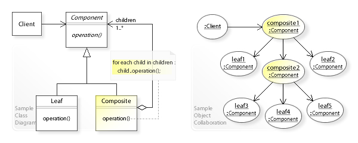

Composite Design Pattern is a structural pattern that lets you treat
individual objects ad groups of objects uniformly.

It is especially useful when you have a tree structure.

### Real-world Example: File System

In a file system:
* File -> leaf node
* Folder -> Composite node (can contain files or other folders)

You can:
* Get size of a file
* Get size of a folder 

Both are treated the same using a common interface.

### When to use composite Pattern

Use it when:
* you need to represent part-whole hierarchy
* You want clients to treat single objects and compositions uniformly
* You are dealing with tree-like structures

Examples:
* UI components
* Organization hierarchy (Manager -> Employees)
* Menu Systems
* Comment threads

### Structure
Core Components
1. Component (Interface/Abstract class)

Defines common operations

2. Leaf 

Represents individual object

3. Composite

Contains list of Components

### UML Structure


### Implementation

Step 1: Component Interface

``` java
interface FileSystemComponent {
    void showDetails();
}
```
Step 2: Leaf Class (File)

```java
import org.example.structural.composite.FileSystemComponent;

class File implements FileSystemComponent{
    private String name;
    
    public File(String name){
        this.name=name;
    }
    
    @Override
    public void showDetails(){
        System.out.println("File: " + name);
    }
}
```

Step 3: Composite Class (Folder)

```java
import org.example.structural.composite.FileSystemComponent;

import java.util.ArrayList;

class Folder implements FileSystemComponent {

    private String name;
    private List<FileSystemComponent> components = new ArrayList<>();
    
    public Folder(String name) {
        this.name = name;
    }
    
    public void  add(FileSystemComponent component){
        components.add(component);
    }
    
    public void remove(FileSystemComponent component){
        components.remove(component);
    }
    
    @Override
    public void showDetails(){
        System.out.println("Folder: "+name);
        for(FileSystemComponent component: components){
            component.showDetails();
        }
    }
}
```

Step 4: Client Code
```java
public class Main {
    public static void main(String[] args) {

        File file1 = new File("resume.pdf");
        File file2 = new File("photo.png");

        Folder folder = new Folder("Documents");
        folder.add(file1);
        folder.add(file2);

        Folder root = new Folder("Root");
        root.add(folder);

        root.showDetails();
    }
}
```

### Key Advantages
without Composite:
* You would need different logic for File and Folder.

With Composite:
* Client treats both using `FileSystemComponent`

```java
import org.example.structural.composite.FileSystemComponent;
import org.example.structural.composite.Folder;

FileSystemComponent component = new Folder("Root");
```
* No need to check `instanceOf`

### Pros & Cons
* Advantages
* Simplifies client code
* Supports recursive tree structures
* Open/Closed principle

**Disadvantage**
* Hard to restrict components in composite
* Can become too generic

### Composite Vs Decorator

| Composite                 | Decorator             |
| ------------------------- | --------------------- |
| Tree structure            | Wrapper structure     |
| Parent-child relationship | Adds behavior         |
| Represents part-whole     | Extends functionality |

